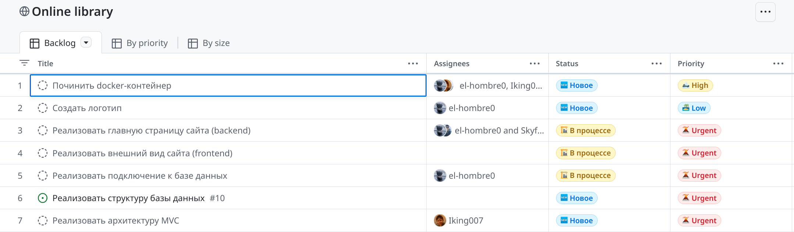

== Практическая работа №2 - Определение функциональных и пользовательских требований
:listing-number: 0
:figure-number: 0
:table-number: 0

*Цель работы:*

Получить навыки по определению функциональных и пользовательский 
требований, распределение тайм-менеджмента для руководителя.

*Задание:*

1. Определить назначение системы, основываясь на 
выбранной предметной области и тематике;

2. Написать User story покрывающие весь функционал реализуемой 
системы/приложения;

3. На основе User story описать функциональные требования;

4. Составить первоначальный план реализации проекта и распределить 
задачи между участниками в сервисе Trello.

*Ход работы:*

[.underline]#Назначение системы:# 

Главные назначения разрабатываемого проекта заключаются 
в упрощении доступа к книгам из открытых источников, ведения прочитанных и 
понравившихся книг и получения краткой информации о них.

User story и функциональные требования приведены в таблице 1 ниже.

.User story и функциональные требования
[cols="2,2,2,3", width="100%",caption="Таблица 1 - "]
|===
| *Кто?* | *Что хочет?* | *С какой целью?* | *Функциональное требование*
| Пользователь | Быстро находить книгу | Экономить время | 
"Поиск" с возможностью ввода названия книги
| Пользователь | Сохранить понравившиеся книги | Не потерять их | 
"Избранное", список, содержащий книги, которые понравились пользователю
| Пользователь | Выбирать тему сайта | Уменьшить яркость в ночное время | 
"Кнопка переключения темы сайта"
| Пользователь | Создать аккаунт | Пользоваться веб-ресурсом | 
"Регистрация" с полями для ввода персональных данных
| Пользователь | Скачать книгу | Читать книгу в офлайн-режиме | 
"Кнопка скачивания книги"
| Пользователь | Получить краткое описание книги | Ознакомиться с сюжетом книги | 
"Превью" с отображением краткого содержания книги
| Пользователь | Добавлять отзывы к книгам | Поделиться мнением с другими пользователями | 
"Оставить отзыв", кнопка добавления отзыва о книге с рейтингом от 1 до 5
| Пользователь | Фильтровать чужие отзывы | Получать достоверную информацию | 
"Фильтр" с возможностью ввода данных для фильтрации контента по дате

| Модератор | Добавлять книги и удалять их | Управлять контентом сайта | 
Кнопки "Добавить книгу", "Удалить книгу"
| Модератор | Редактировать информацию о книге | Исправлять текст описания и картинки |
"Редактор" с возможностью ввода текста и загрузки картинки
| Модератор | Удалять отзывы | Подвергать цензу отзывы о книгах | 
"Удалить отзыв" с указанием идентификатора отзыва для удаления

| Администратор | Менять роли пользователей | Ограничить права пользователей | 
"Панель администратора", которая содержит такие компоненты, как 
"Список модераторов", "Добавить модератора" и "Удалить модератора" 
c указанием идентификаторов модераторов
|===

План реализации проекта и распределение задач изображён на рисунке 1 ниже.

.Распределение задач в команде

