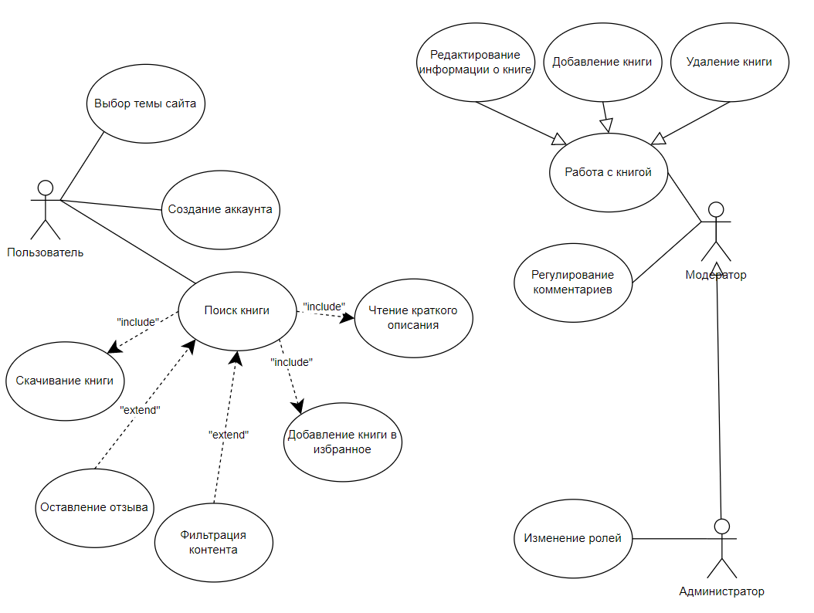
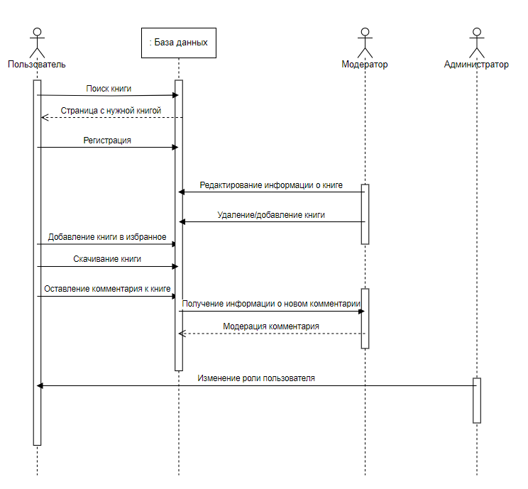

== Практическая работа №3 - Начальное моделирование предметной области проекта
:listing-number: 0
:figure-number: 0
:table-number: 0

*Цель работы:*

Получить навыки по работе с контрольной группой пользователей, определением USE case диаграммы 
своего проекта, а также разработки диаграммы последовательности. В случае разработки проекта, 
связанного с игровой деятельностью, умение создавать EPC диаграммы.

*Ход работы:*

Ниже представлен портрет пользователя проектируемой системы.

*Портрет пользователя:*

*ФИО:* Евгеньев Дмитрий Анатольевич, 24 года

*Место проживания:* Москва, ЮАО

*Семейное положение:* не женат, детей не имеет

*Сфера занятости:* Переводчик

*Уровень зарплаты:* 85 тыс. рублей

*Должность:* переводчик со знанием английского языка (документальное вещание) занимается переводо
различных документов и писем, в зависимости от требований компании.

*Потребности:* необходимо постоянно поддерживать свои способности в переводе различных текстов. 
В частности, перевод произведений с русского языка на английский.

*Построение USE-case диаграммы:*

Цель – предоставление доступа к обширной электронной библиотеке широкому кругу людей. В данном случае 
для клиентов функциональностью является: поиск книги, сохранение книги, выбор темы, создание аккаунта, 
скачивание книги, чтение краткого описания книги, оставление отзыва, фильтрация контента. Для модератора 
функциональностью является: добавление и удаление книги, редактирование информации о книгах, регулирование 
комментариев. Для администратора функциональностью является работа с правами пользователей и изменение их ролей. 
Построенная USE-case диаграмма представлена на рисунке 1.

.Диаграмма USE-case

*Диаграмма последовательности взаимодействия пользователей с системой:*

Диаграмма последовательности является одной из разновидности диаграмм взаимодействия и предназначена для моделирования 
взаимодействия объектов системы во времени, а также обмена сообщениями между ними.

Диаграмма последовательности объединяет диаграмму деятельности, диаграмму состояний и диаграмму классов.

Таким образом, на диаграмме последовательности мы можем увидеть следующие аспекты:

1. Сообщения, побуждающие объект к действию;

2. Действия, которые вызываются сообщениями (методы) – зачастую это передача сообщения следующему
объекту или возвращение определенных данных объекта;

3. Последовательность обмена сообщениями между объектами.

Диаграммы взаимодействия последовательностипредназначеныдля междуобъектами.Зачастую несколькими
моделирования диаграммы последовательности создаются для моделирования взаимодействия в рамках одного
прецедента.

На диаграмме последовательности объекты в основном представляю экземпляры класса или сущности, обладающие 
поведением. В качестве объектов могут выступать пользователи, инициирующие взаимодействие, классы,
обладающие поведением в системе или программные компоненты, а иногда и системы в целом.

Объекты располагаются слева направо таким образом, чтобы крайним слева был тот объект, который инициирует 
взаимодействие. Неотъемлемой частью объекта на диаграмме последовательности является линия жизни объекта. Линия жизни 
показывает время, в течение которого объект существует в системе. Периоды активности объекта в момент взаимодействия
показываются с помощью фокуса управления. Временная шкала на диаграмме направлена сверху вниз. Диаграмма 
последовательности для нашей системы представлена на рисунке 2.

.Диаграмма последовательности

<<<